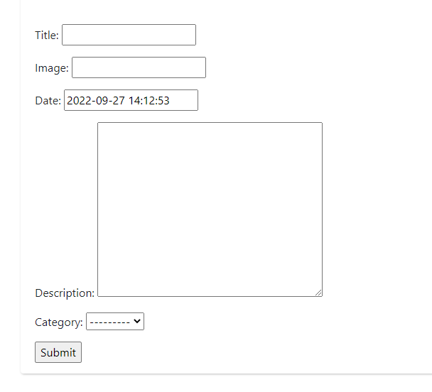

<h1>  Blog Qatar World Cup - DjangoProject EN-US </h1>

[README em PT-BR](https://github.com/Flyinng/ScrapyProject/blob/main/README-PT-BR.md)

##  Work using Django, a Python framework ⚙

Django is a rapid web development framework written in Python that uses the model-template-view pattern.
 
See more about Django at: 

### Program features:

  + Create posts with categories, titles, descriptions and images.
  

  + You can see your posts on specific pages in a screen with the articles
   
  
### How to download and run the project:

  + First, download the project from Github: ``git clone https://github.com/Flyinng/CRUD-Supermarket``.

  + Then install the Scrapy library in your IDE.

  + In your IDE's terminal, use the command ``cd main`` and then the command ``cd spiders`` to access Crawler.

  + After that, in the terminal type the command ``scrapy crawl bs -O data.json``.
  
  + This will gather all the product data in the respective stores, to get the lowest value run the ``refactor.py`` file.
 
📜Project developed in the <a href="https://www.entra21.com.br/">Entra21</a> Python Class

