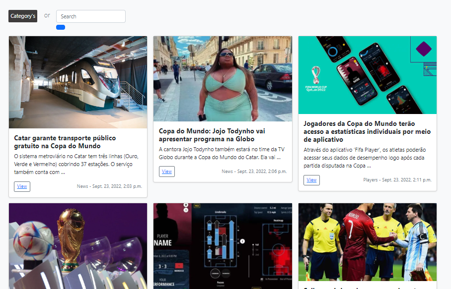
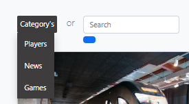

<h1>  Blog Qatar World Cup - DjangoProject EN-US </h1>

[README em PT-BR](https://github.com/Flyinng/ScrapyProject/blob/main/README-PT-BR.md)

##  Work using Django, a Python framework ⚙

Django is a rapid web development framework written in Python that uses the model-template-view pattern.
 
See more about Django at: 

## Program features:

  + Create posts with categories, titles, descriptions and images.
  

  + You can see your posts on specific pages in a screen with the articles
   
  
  + The posts are all gathered on the main page of the site.
   
  
  + Posts can be filtered by the search bar or by categories (news, players and games)
   
  
  
### How to download and run the project:

  + First, download the project from Github: ``git clone https://github.com/Flyinng/Blog-DJangoProject``.

  + Then install the Django library in your IDE.

  + In your IDE's terminal, use the command ``cd BlogProject`` and then the command ``python manage.py runserver`` to access the WebSite.
  + 
 
📜Project developed in the <a href="https://www.entra21.com.br/">Entra21</a> Python Class

